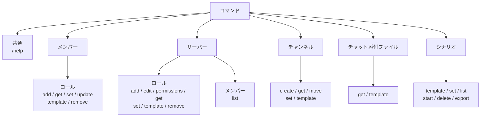

# DiscordBot_Servercontroller

## 概要

Discord.py で作成した Discord Bot です。メンバー・ロール・チャンネルの管理、CSV によるロール設定の一括更新などを行えます。

## セットアップ

### コードを使用する場合

1. Python 3.10 以降を用意します。
2. discord.py をインストールします。

```powershell
pip install discord.py
```

3. `Src/config/config.json` に Bot トークンを設定します。

```json
{
   "BOT_TOKEN": "Botのトークン"
}
```

4. Discord Developer Portal で、Bot の以下の Intent を有効にします。
   - Message Content Intent
   - Server Members Intent
   - Reactions と Voice States はコードで使用しています。

5. 起動します。

```powershell
python Src/bot_main.py
```

### テスト

開発用依存関係をインストールして、プロジェクトルートからテストを実行します。

```powershell
python -m pip install -r requirements-dev.txt
python -m pytest
```

### exeを使用する場合

Pythonがインストールされていない環境では、`release`フォルダ内のexeを使用できます。

1. `release/config/config.json` に Bot トークンを設定します。

```json
{
   "BOT_TOKEN": "Botのトークン"
}
```

2. `release/DiscordBot_Servercontroller.exe`を実行します。

exe版ではPythonやdiscord.pyのインストールは不要です。処理結果のCSV・ZIPは`release/temp`に一時保存され、Discordへの送信後に削除されます。

Bot トークンは公開せず、設定ファイルを Git にコミットしないでください。

## 補助GUIツール

補助ツールはPython標準ライブラリのTkinterを使ったGUIです。Python環境では、リポジトリのルートから次のコマンドで起動できます。Windowsでは設定エディターのexeも利用できます。

### 設定エディター

```powershell
python Src/tools/config_editor/config_editor.py
```

Bot設定の確認・編集、項目の追加・削除ができます。Windowsでは [csv_editor.exe](../release/tools/csv_editor.exe) の「設定」タブから使え、既定で `release/config/config.json` を開きます。Python版は既定で `Src/config/config.json` を開きます。別の設定ファイルを指定する場合は、exeまたはコマンドの末尾にJSONファイルのパスを渡してください。トークンなどの秘密情報は画面上でマスクされます。保存した設定をBotに反映するにはBotの再起動が必要です。設定ファイルを公開したりGitにコミットしたりしないでください。

### テンプレートエディター

```powershell
python Src/tools/template_editor/template_editor.py
```

CSVテンプレートのセルをダブルクリックして編集できます。行・列の追加や削除、列名変更、上書き保存、別名保存に対応しています。左側の一覧にはファイル名と種別（CSV/ZIP）が表示されます。Python版は `Src/templates`、[csv_editor.exe](../release/tools/csv_editor.exe) のテンプレートタブは `release/tools/templates` のCSVとCSVを含むZIPを既定で一覧表示します。

### サーバーロールCSVエディター

```powershell
python Src/tools/server_role_editor/server_role_editor.py
```

サーバーロール設定CSVのロール行を専用画面で追加・削除し、ロール名・色・権限を編集できます。権限列は必要なものだけ追加・削除できます。既定では `Src/templates/set/input/server_role_template.csv` を開き、別のCSVを開く場合はコマンドの末尾にパスを指定します。
Windowsでは [csv_editor.exe](../release/tools/csv_editor.exe) の該当タブから使えます。

### メンバーロールCSVエディター

```powershell
python Src/tools/member_role_editor/member_role_editor.py
```

メンバーのロールCSVの行を専用画面で追加・削除し、ロール列を増減できます。`/member role set` 用（追加/削除, ユーザーID, ユーザー名, 表示名, ロール1…）と `/member role update` 用（User ID, Name, Display Name, Role1…）を列名から自動判別します。保存時に、操作・メンバー指定・ロール名・ユーザーIDの入力ミスを確認します。既定では `Src/templates/set/input/member_role_template.csv` を開き、別のCSVを開く場合はコマンドの末尾にパスを指定します。
Windowsでは [csv_editor.exe](../release/tools/csv_editor.exe) の該当タブから使えます。

### チャンネルCSVエディター

```powershell
python Src/tools/channel_editor/channel_editor.py
```

`/channel set` 用CSVの行を専用画面で追加・削除し、`role_N` 列（参加を許可するロール）と `user_N` 列（追加するユーザー）を増減できます。種類（`text` / `voice`）はプルダウンで選べ、保存時にチャンネル名と種類を確認します。既定では `Src/templates/set/input/channel_template.csv` を開き、別のCSVを開く場合はコマンドの末尾にパスを指定します。
Windowsでは [csv_editor.exe](../release/tools/csv_editor.exe) の「チャンネル」タブから使えます。

### 統合エディター

```powershell
python Src/tools/csv_editor/csv_editor.py
```

設定・テンプレート・サーバーロール・メンバーロール・チャンネル・シナリオの各エディターを1つのウィンドウのタブにまとめたアプリです。未保存の変更があるタブには `*` が付き、終了時に確認します。各エディターは従来どおり単体でも起動できます。
Windowsでは [csv_editor.exe](../release/tools/csv_editor.exe) から起動できます。

### シナリオエディター

```powershell
python Src/tools/scenario_editor/scenario_editor.py
```

CSVファイルまたはCSVを含むフォルダを開き、シナリオ、ステップの指示・完了条件・返信、分岐を編集できます。フォルダを開いた場合は、CSVごとのシナリオをIDとファイル名で選択できます。完了条件がリアクションの場合や分岐リアクションは、検索できるUnicode絵文字一覧から選択できます。保存時は変更した元CSVへの上書き確認が表示されます。Windowsでは [csv_editor.exe](../release/tools/csv_editor.exe) の該当タブから使えます。

## コマンド

コマンドはスラッシュコマンド形式で利用します。`/help` で利用可能なコマンド一覧を表示できます。



### 共通機能

```text
/help
```

### メンバーロール機能

```text
/member role add @メンバー ロール名
/member role get ユーザー名
/member role set + CSVファイル
/member role update + メンバー一覧CSV
/member role template
/member role remove @メンバー ロール名
```

CSV形式は [テンプレートファイル](#テンプレートファイル) の `member_role_template.csv` を参照してください。

`get` はDiscordユーザー名に一致するメンバーのロール一覧を返信します。メンションで指定することもできます。現在、CSVではなくテキスト返信です。`set` CSVは「ユーザーID」を優先し、IDが空の場合は「ユーザー名」、次に「表示名」で検索します。ID列がない従来形式のCSVも引き続き利用できます。

`set` CSVの `ロール1`、`ロール2` などの列に複数ロールを指定できます。従来形式の `ロール` 列にも対応します。処理結果は `result` 列、失敗理由は `reason` 列に記録されます。

`update` は `/server member list` のCSVを編集して添付すると、`User ID` を優先してメンバーを特定します。ID列がない、または空欄の場合は `Name`（Discordユーザー名）、次に `Display Name` の順で検索し、各メンバーのロールを `Role1`、`Role2` などの列の内容へ置き換えます。結果CSVには `result` と `reason` 列が追加されます。デフォルトロールとBot・連携サービス管理のロールは変更されません。

`add`、`set`、`update`、`remove` には「ロールの管理」権限が必要です。

### サーバーロール機能

```text
/server role add ロール名
/server role edit ロール名 権限名 on|off
/server role edit ロール名 color #RRGGBB
/server role permissions
/server role get
/server role set + CSVファイル
/server role template
/server role remove ロール名
```

CSV形式は [テンプレートファイル](#テンプレートファイル) の `server_role_template.csv` を参照してください。

`/server role permissions` で、権限名・英語説明・日本語訳・設定可能な値（`on` / `off`）を記載したCSVを取得できます。

`/server role get` が出力するCSVは `/server role set` に添付して再利用できます。`set` の結果CSVには `result` と `reason` 列が追加されます。

`add`、`edit`、`set`、`remove` には「ロールの管理」権限が必要です。

### メンバー一覧機能

```text
/server member list
```

サーバーのメンバー一覧をCSVファイルで取得します。`User ID`、`Name`、`Display Name`、`Role1`、`Role2` の列を出力し、ロールは個別の列に記載します。CSVが大きい場合は、通信時間を短縮するためZIP形式で返信します。

### チャンネル機能

```text
/channel create text チャンネル名 [カテゴリー名]
/channel create voice チャンネル名 [カテゴリー名]
/channel move #チャンネル カテゴリー名
/channel get
/channel set + CSVファイル
/channel template
```

チャンネルの作成・移動には「チャンネルの管理」権限が必要です。指定したカテゴリーが存在しない場合は自動作成します。

`/channel get` でサーバーのチャンネル一覧を `name,type,category` 形式の CSV ファイルとして取得できます。

このCSVは `/channel set` に添付して再利用できます。結果CSVには `result` と `reason` 列が追加されます。ロール列を1つ以上指定した場合は記載ロールだけにアクセスを許可し、未記載ロールの既存アクセス許可を解除します。ロール列が空の場合は既存権限を維持します。`user_1`、`user_2` などの列にはDiscordユーザー名を指定でき、該当メンバーへチャンネルアクセスを追加します。既存のユーザー別権限は変更しません。

CSV形式は [テンプレートファイル](#テンプレートファイル) の `channel_template.csv` を参照してください。

`type` には `text` または `voice` を指定します。既存チャンネルは名前で検索してカテゴリーを変更し、存在しない場合は新規作成します。カテゴリーが存在しない場合は自動作成します。

### チャット添付ファイル機能

```text
/chat get #テキストチャンネル [開始日 YYYY-MM-DD] [拡張子]
/chat get + CSVファイル
/chat template
```

チャンネルをメンションすると、単一チャンネルの添付ファイルを取得できます。開始日は省略可能で、指定する場合は `YYYY-MM-DD` 形式です。指定日の00:00（UTC）以降が対象になります。拡張子は `png` または `.png` の形式で指定でき、`png|jpg|gif` のように複数指定できます。

CSVに `category_name,channel_name,start_date,extension` を指定すると、各行のチャンネルから開始日以降の添付ファイルを取得し、`カテゴリー名/チャンネル名/ファイル名` の構成で1つの ZIP ファイルにまとめて返信します。`start_date` または `extension` を空欄にすると、その条件では絞り込みません。実行には「メッセージの管理」権限が必要です。

CSV形式は [テンプレートファイル](#テンプレートファイル) の `chat_template.csv` を参照してください。

### イベント通知機能

以下はサンプル機能です。運用環境の要件に合わせて、処理内容や通知先を変更・無効化してください。

- ボイスチャンネルへ参加・退出すると、対象ボイスチャンネルのテキストチャットへ通知します。
- 新規メンバー参加時は、参加ログを出力します。

### シナリオ進行機能

```text
/scenario template
/scenario set + CSVファイル
/scenario list
/scenario start シナリオID [開始step]
/scenario delete シナリオID
/scenario export
```

シナリオは `Src/config/scenario_definitions.json` に保存され、サーバーごとの進行状態は `Src/config/scenario_states.json` に保存されます。`/scenario set` は既存のシナリオを保持したままCSVの内容を追記します。同じシナリオIDとステップ番号がある場合は更新されます。登録結果を `result` / `reason` 列に記録したCSVを返信します。`/scenario export` のCSVは `/scenario set` に再利用できます。

CSV形式と `welcome` シナリオの例は [テンプレートファイル](#テンプレートファイル) の `scenario_template.csv` を参照してください。

`completion_type` が `reaction` の場合、現在の指示メッセージにリアクションが付くと次へ進みます。`completion_value` が `*` または空欄なら任意のリアクション、絵文字を指定した場合はその絵文字だけが有効です。リアクション条件の指示メッセージには、見本となるリアクションが自動で追加されます。

複数の分岐は、1行に `branch_reaction_N` と `branch_step_N` の列を追加して指定できます。分岐先は現在のシナリオ内のstepに限定されます。

## テンプレートファイル

CSVテンプレートは `Src/templates` の用途別フォルダにあります。必要なCSVを編集して各コマンドに添付してください。

### Set 入力

- [channel_template.csv](../Src/templates/set/input/channel_template.csv): チャンネル設定
- [member_role_template.csv](../Src/templates/set/input/member_role_template.csv): メンバーロール設定
- [server_role_template.csv](../Src/templates/set/input/server_role_template.csv): サーバーロール設定
- [scenario_template.csv](../Src/templates/set/input/scenario_template.csv): シナリオ登録
- [team_match_scenario.csv](../Src/templates/set/input/team_match_scenario.csv): チーム戦シナリオ例

### Get 入力

- [chat_template.csv](../Src/templates/get/input/chat_template.csv): 複数チャンネルの添付ファイル取得

### 応答・結果の配置

- [Set応答フォルダ](../Src/templates/set/response/README.md): Setの結果CSVについて
- [Get結果フォルダ](../Src/templates/get/result/README.md): Getの出力について

応答・結果ファイルは`temp`フォルダへ一時保存され、Discordの添付ファイルとして返信した後に削除されます。

## ライセンス

- [プロジェクトライセンス（MIT）](licenses/LICENSE)
- [第三者OSSライセンス一覧](licenses/THIRD_PARTY_LICENSES.md)
